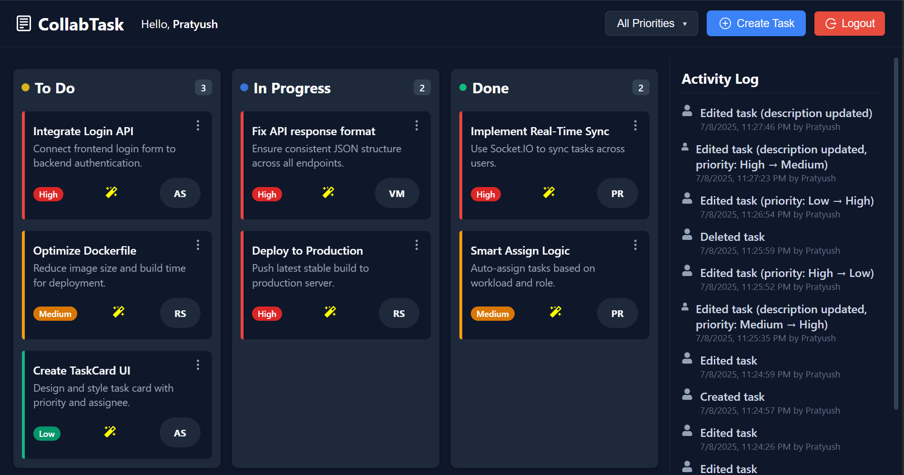
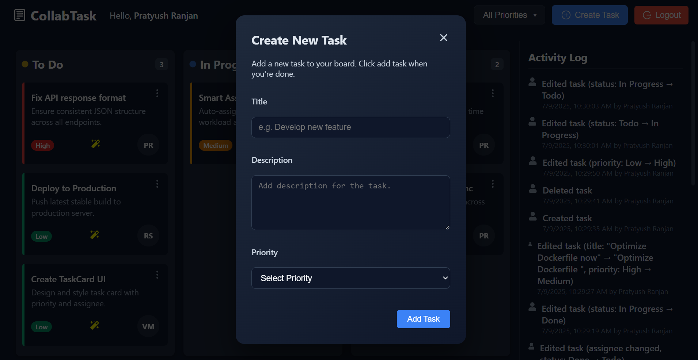
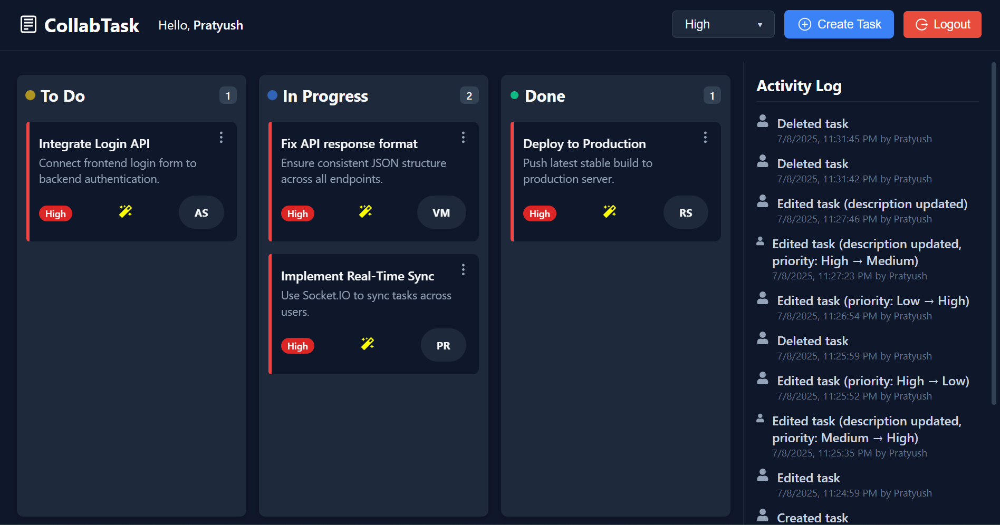

# 🚀 Real-Time Collaborative To-Do Board  
**Build. Assign. Collaborate. Instantly.**

An intuitive, **Kanban-style task management** board with real-time collaboration, intelligent task assignment, and conflict resolution — built for the **Webalar Full Stack Internship Assignment**.

🌐 Live Demo: [CollabTask](https://real-time-collaborative-todo-board.vercel.app/dashboard)   
📦 GitHub Repo: [real-time-collaborative-todo-board](https://github.com/pratyushranjn/real-time-collaborative-todo-board)

---

## 🧩 Project Overview

This is a full-stack MERN application that enables **multiple users to collaborate on tasks** in real-time using a Kanban interface — inspired by Trello.  
It includes:

- 🔐 **Secure login** via JWT + HTTP-only cookies  
- 🔄 **Live task sync** via Socket.IO (WebSockets)  
- ✨ **Smart Assign** to auto-distribute tasks  
- ⚠️ **Conflict Detection** during concurrent edits  
- 📃 Real-time **Activity Log** (last 20 actions)  
- 🧼 Clean, responsive UI with zero UI frameworks  

---

## 📌 Core Features

- ✅ JWT-based user auth with cookies  
- ✅ Drag-and-drop Kanban board (`Todo`, `In Progress`, `Done`)  
- ✅ Real-time sync across users using Socket.IO  
- ✅ Smart Assign: AI-like logic to find least busy user  
- ✅ Conflict resolution: prevents overwriting newer task versions  
- ✅ Activity Log Panel: shows latest 20 actions with user info  
- ✅ Edit/Delete functionality with modal popups  
- ✅ Responsive layout (mobile-friendly)  
- ✅ No UI libraries — built entirely with **custom React + CSS**

---

## 🧰 Tech Stack

### 💻 Frontend
- React + Vite
- React Router DOM
- Context API
- Axios
- Socket.IO Client
- Vanilla CSS (no frameworks)

### 🖥 Backend
- Node.js + Express.js
- MongoDB + Mongoose
- JWT + HTTP-only Cookies
- Bcrypt.js
- Socket.IO
- Dotenv + CORS

---

## 🖼️ UI Layout

🔳 **Three Kanban Columns**:
- **Todo**
- **In Progress**
- **Done**

🧾 Each task card includes:
- Task title & description
- Priority badge (`High`, `Medium`, `Low`)
- Assignee initials (if assigned)
- Options menu: `Edit`, `Delete`
- ✨ Smart Assign icon (magic wand)

📋 **Right-side panel**:
- Real-time Activity Log  
- Shows actions like `Created`, `Updated`, `Assigned`, `Deleted`  
- Includes username + timestamp

---


## 📷 Screenshots

### 🧼 Dashboard — Clean View
The dashboard displays a clean and minimal view in Kanban columns.



---

### ✍️ Create Task — with Priority 
Users can easily create new tasks using a modal form. Newly created tasks appear instantly for all users and include:
- Priority badge (`High`, `Medium`, `Low`)
- Smart-assigned user initials
- Edit and delete options



---

### 🔄 Priority-Based Task Movement
Tasks can be **dragged and dropped** across the three Kanban columns:
- Todo → In Progress → Done  
With real-time synchronization and persistent priority indicators.




# Backend Environment Variables
MONGO_URL=mongodb+srv://<username>:<password>@cluster.mongodb.net/<dbname>
JWT_SECRET=your_jwt_secret
NODE_ENV=development

# Frontend Environment Variables (Vite)
VITE_BACKEND_URL=https://your-backend-domain.com/api
VITE_SOCKET_URL=https://your-backend-domain.com


## ⚙️ Setup Instructions

### 1. Clone the Repository

```bash
git clone https://github.com/pratyushranjn/real-time-collaborative-todo-board.git

cd real-time-collaborative-todo-board

